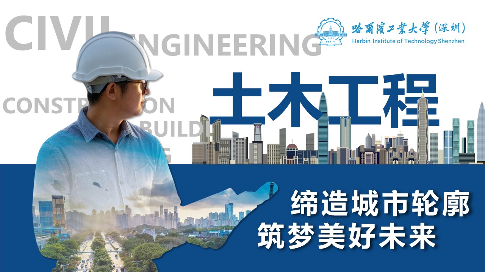

{:width="20%" .align-center}

Welcome to **Construction Informatics** / **Collective Intelligence** **Laboratory**!

We a multidisciplinary team of civil engineers, electrical engineers, software engineers, and project managers. We utilize principles from cross scientific domains to develop and construct flexible and bright buildings and infrastructures! CI Lab was established by Dr. Xincong Yang at [School of Civil and Environmental Engineering](http://sce.hitsz.edu.cn/), [Harbin Institute of Technology, Shenzhen](https://www.hitsz.edu.cn/index.html), in 2023.

欢迎来到**建筑信息化/群体智能实验室**！

我们从事土木工程与计算机、电子信息工程、管理学的交叉科学研究，为建设更加和谐和开放的人居环境而不懈努力！CI实验室成立于2023年，目前位于哈尔滨工业大学（深圳）土木与环境工程学院。

Our Vision / 我们的愿景
-----
To drive for automation, intelligence, and excellence of the Architecture, Engineering, Construction, Maintenance, and Operation (AECO) industry.

我们的愿景是让建筑业全产业数字化、信息化、智能化！

Our Mission / 我们的使命
-----

{:width="100%" .align-center}

To improve the performance of the AECO industry in China by providing novel theoretical and practical solutions, containing artificial internet of things, antonomous robots, and future technical skills.

我们的使命是通过创新的理论和方法，包括智能物理网，机器人以及其他面向未来的技术，来切实提高中国建筑业的生产力和管理水平！

Our Group / 我们的成员
-----

**Postgraduates / 在读硕士**

- 2021
  - MI Qingren / 米庆仁 在读
  - WANG Jianan / 王嘉楠 在读

- 2022
  - ZHOU Zixuan / 周子璇 在读
  - MIN Jie / 闵杰 在读
  - CHEN Yu / 陈豫 在读

**Undergraduates / 在读本科**

- 2023
  - LIU Hang (HITSZ) / 刘行 保送哈尔滨工业大学（深圳）

- 2022
  - JIN Xinxiang (Tsinghua University) / 金新翔 保送清华大学
  - YE Jingang (Tongji University) / 叶进刚 保送同济大学
  - HUANG Wuguang (HITSZ) / 黄武光 在读

**Master of Engineering / 工程管理硕士**

- 2021
  - ZHENG Yang / 郑杨 在读
  - ZHANG Meng / 张孟 在读

